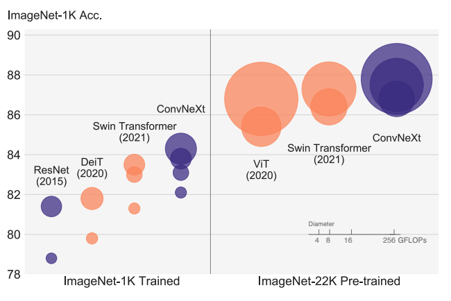

# ConvNeXt implimentaion written from scratch in PyTorch

Model parameters and architecture based on the whitepaper `"A ConvNet for the 2020s"` by Zhuang Liu, Hanzi Mao, Chao-Yuan Wu, Christoph Feichtenhofer, Trevor Darrell, & Saining Xie at Facebook AI Research (FAIR) together with UC Berkeley.
 

Link to the paper:
https://arxiv.org/pdf/2201.03545.pdf
 
 
## ImageNet-1K classification results for ConvNets, vision Transformers, and ConvNeXt

 
 

| Pre-Training Config        | ConvNeXt-T/S/B/L/XL |
|-------------|-------------|
| `optimizer`  | AdamW |
| `base learning rate`    | 5e-5 |
| `weight decay`  | 1e-8 |
| `optimizer momentum`      | β1, β2 = 0.9, 0.999|
| `batch size`  | 512 |
| `training epochs`       | 30|
| `learning rate schedule`  | cosine decay|
| `layer-wise lr decay`  | 0.8 |
| `warmup epochs` | None|
| `warmup schedule` | N/A |
| `randaugment` | (9, 0.5) |
|  `mixup` |  None |
| `cutmix`    | None|
| `random erasing`| 0.25 |
|  `label smoothing`| 0.1|
|  `stochastic depth`|  0.0 / 0.1 / 0.2 / 0.3 / 0.4|
|  `layer scale`| pre-trained |
| `head init scale`| 0.001 |
| `gradient clip`| None |
| `exp. mov. agv. (EMA)`| None(T-L) / 0.9999(XL)|
